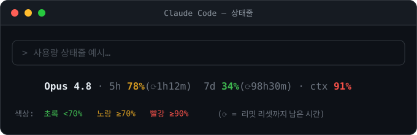

# claude-statusline

Claude Code 상태줄에 **사용량(rate limit)**과 **컨텍스트 사용률**을 띄워주는 스크립트.

별도 툴(ccusage 등) 없이 Claude Code 내장 `statusLine` 기능만 사용한다.
사용량 데이터는 Claude Code가 상태줄 command로 넘겨주는 JSON에서 뽑아온다.



## 표시 항목

```
Opus 4.8 · 5h 42%  7d 18%(⟳3h05m) · ctx 27%
```

- **모델명** — 현재 사용 중인 모델
- **5h** — 5시간 리밋 사용량
- **7d** — 주간 리밋 사용량, `(⟳남은시간)`은 리밋 리셋까지 남은 시간
- **ctx** — 컨텍스트 윈도우 사용률

퍼센트 색상: 90%↑ 빨강 / 70%↑ 노랑 / 그 이하 초록.

> 사용량(5h·7d)은 **첫 응답 이후**부터 표시된다. 세션을 막 시작했을 땐
> `usage: (첫 응답 후 표시)`로 뜬다.

## 설치

```bash
git clone https://github.com/iamracco0n/claude-statusline.git
cd claude-statusline
./install.sh
```

`install.sh`가 하는 일:
1. `statusline.sh`를 `~/.claude/`로 복사
2. `~/.claude/settings.json`에 `statusLine` 블록 등록 (기존 설정은 보존)

설치 후 Claude Code를 재시작하면 상태줄에 사용량이 뜬다.

## 수동 설치

`statusline.sh`를 `~/.claude/`에 복사하고, `~/.claude/settings.json`에
[`settings.example.json`](settings.example.json)의 `statusLine` 블록을 추가한다.

## 커스터마이즈

`~/.claude/statusline.sh`를 직접 수정하면 된다.
- 색상 임계값: `pct_color()` 함수의 `90`, `70`
- 표시 항목: `parts.append(...)` 부분
- 리밋 종류: `fmt_limit('5h', 'rate_limits.five_hour')` 등

## 제거

`~/.claude/settings.json`에서 `statusLine` 블록을 지우거나,
Claude Code에서 `/statusline` 명령으로 끈다.
